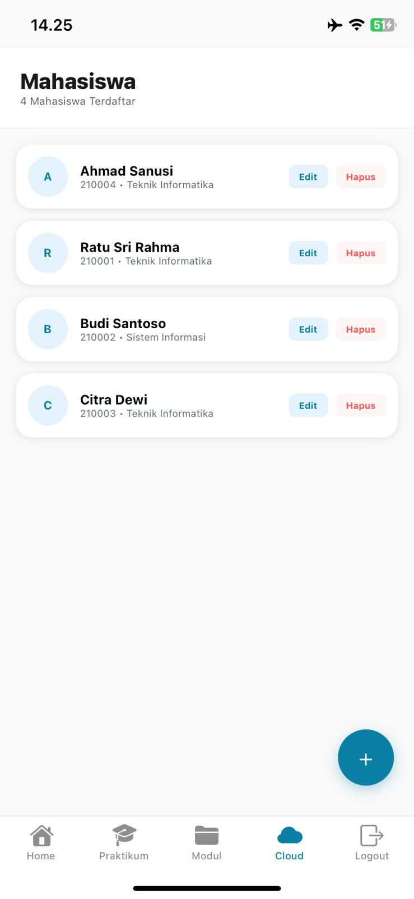

# Belajar Expo – Pemrograman Perangkat Mobile 2

Repo ini berisi **project praktikum** untuk mata kuliah **Pemrograman Perangkat Mobile 2**, pakai **Expo** dan **React Native**. Di sini kamu bisa jalankan app, lihat contoh kode, dan ikuti panduan praktikum—**Praktikum 2** (Functional Component, props, useState), **Praktikum 3** (CRUD, Login, Logout), serta **koneksi ke database cloud Supabase** (baca data mahasiswa lewat tab **Cloud**).

---
## Tampilan Aplikasi

### 1. Tampilan Dashboard


## Isi Repo Ini Apa Saja?

Singkatnya: **satu app Expo** yang saat dibuka selalu tampil **halaman Login** dulu (demo). Setelah tap **Masuk**, kamu masuk ke **tab utama**: Home, Explore, Praktikum, Modul, **Cloud**, dan Logout.

| Tab | Fungsi singkat |
|-----|----------------|
| **Home / Explore** | Contoh layar dari template Expo |
| **Praktikum** | Functional Component: Header, Card, Counter, dll. |
| **Modul** | **CRUD data mahasiswa** di **memori lokal** (useState)—tambah, ubah, hapus, pagination; tabel atau kartu sesuai lebar layar |
| **Cloud** | **Baca data mahasiswa** dari **Supabase** (PostgreSQL di cloud)—tabel `public.mahasiswa`; pull-to-refresh & tombol muat ulang |
| **Logout** | Konfirmasi sebelum kembali ke halaman login |

Teori dan langkah belajarnya ada di **`doc/`**: **PRAKTIKUM_02** (Functional Component) dan **PRAKTIKUM_03** (CRUD, Login, Logout). Component praktikum 2 ada di **`components/praktikum/`**. Kalau kamu baru pertama kali pakai Expo/React Native, repo ini cocok buat starting point: struktur project rapi, ada contoh yang bisa di-run langsung, dan ada penjelasan per file biar enggak bingung "ini file buat apa sih".

---

## Supabase + Expo (untuk Mahasiswa): Ringkasan Konsep

**Supabase** = layanan **backend-as-a-service**: database **PostgreSQL** di internet, API otomatis, bisa diakses dari app (termasuk Expo) pakai **URL project** dan **kunci anon (JWT)**.

**Bedanya tab Modul vs tab Cloud**

- **Modul:** Data disimpan di **state React** (`useState`) di HP. Kalau app ditutup, data contoh bisa kembali ke default (tergantung kode). **Tidak** perlu internet untuk CRUD lokal.
- **Cloud:** Data diambil dari **tabel nyata** di server Supabase. Perlu **internet**, **project Supabase**, tabel sudah dibuat (pakai SQL), dan **file `.env`** berisi URL + anon key.

**Yang aman dipakai di app (client)**

- **URL project** dan **anon public key** — memang didesain untuk dipakai di aplikasi, **asalkan** di Supabase sudah diatur **Row Level Security (RLS)** dan policy yang wajar. Di project contoh ini, policy untuk role `anon` bisa dibuat longgar untuk **pembelajaran**; untuk produksi harus diperketat.

**Yang jangan dibundel ke app**

- **Secret key** (`sb_secret_...`) — hanya untuk server, Edge Function, atau skrip admin. Simpan di `.env` tanpa awalan `EXPO_PUBLIC_` dan **jangan** di-import ke layar yang di-build ke HP.

File **`lib/supabase.ts`** membuat **satu klien** Supabase memakai variabel dari `.env`. Halaman **`app/(tabs)/mahasiswa-cloud.tsx`** memanggil `.from('mahasiswa').select(...)` untuk menampilkan tabel.

---

## Setup Supabase (Langkah demi Langkah)

Ikuti urutan ini supaya tab **Cloud** bisa menampilkan data.

### 1) Buat project di Supabase

1. Buka [supabase.com](https://supabase.com), login, lalu **New project** (pilih organisasi, password database, region, dll.).
2. Tunggu sampai project **Ready**. Setelah itu, baru kamu bisa ambil URL dan API key (langkah di bawah).

#### Cara melihat & menyalin API Key di dashboard Supabase

Supabase tidak menyebut satu tombol “API key” saja — ada **URL project** dan beberapa **kunci** dengan fungsi beda. Ikuti ini supaya tidak salah tempel ke `.env`:

1. **Masuk ke project kamu**  
   Di dashboard Supabase, klik **nama project** yang mau dipakai (kalau punya banyak project).

2. **Buka menu pengaturan API**  
   - Klik ikon **Settings** (gerigi / *gear*) di **sidebar kiri** (biasanya paling bawah), **atau**  
   - Dari menu project, cari **Project Settings** → bagian yang berhubungan dengan **API**.

3. **Buka bagian API / Data API**  
   Di sidebar pengaturan project, pilih **“API”** atau **“Data API”** (nama bisa sedikit beda tergantung versi tampilan dashboard). Di halaman ini kamu akan melihat informasi koneksi ke backend.

4. **Yang perlu kamu catat untuk project Expo ini**

   | Di dashboard Supabase (istilah umum) | Isi ke file `.env` (lihat `.env.example`) |
   |--------------------------------------|-------------------------------------------|
   | **Project URL** — alamat `https://xxxx.supabase.co` | `EXPO_PUBLIC_SUPABASE_URL` |
   | **anon** / **anon public** — biasanya **JWT** (string panjang diawali `eyJ...`) | `EXPO_PUBLIC_SUPABASE_ANON_KEY` |
   | *(Opsional)* **Publishable key** — format baru `sb_publishable_...` | `EXPO_PUBLIC_SUPABASE_PUBLISHABLE_KEY` |
   | *(Jangan dipakai di app HP)* **Secret key** — `sb_secret_...` | `SUPABASE_SECRET_KEY` (hanya untuk server/skrip admin) |

5. **Kalau ada dua tab kunci (“API Keys” baru vs “Legacy”)**  
   Dashboard terbaru sering punya tab **Publishable and secret API keys** (format `sb_publishable_...` / `sb_secret_...`) dan tab terpisah untuk **Legacy anon / service_role** (JWT lama). Untuk tab **Cloud** di app ini, yang **wajib** biasanya adalah **Project URL** + **anon (JWT)**. Publishable key opsional kecuali nanti materi atau library kamu mengharuskan format baru itu.

6. **Menyalin dengan aman**  
   - Klik ikon **salin** (clipboard) di samping nilai, atau blok teks lalu salin.  
   - **Jangan** share screenshot yang terlihat **secret key** ke forum publik atau tugas yang bisa dibaca semua orang. Untuk tugas LMS, cukup jelaskan bahwa kunci disimpan di `.env` lokal.

7. **Project reference**  
   Potongan teks di tengah URL (`https://<ini>.supabase.co`) adalah **project reference** — sama dengan yang sering muncul di dalam payload JWT anon. Itu membantu memastikan URL dan anon key dari **project yang sama**.

Setelah URL dan anon key tercatat, lanjut isi **`.env`** (langkah 3 di bawah).

### 2) Buat tabel `mahasiswa` di SQL Editor

1. Di dashboard Supabase: **SQL Editor** → query baru.
2. Buka file **`doc/supabase_mahasiswa.sql`** di repo ini, **salin seluruh isinya**, tempel di SQL Editor, lalu **Run**.
3. Cek **Table Editor** → schema **public** → tabel **`mahasiswa`** (ada kolom `id`, `nim`, `nama`, `prodi`, `kelas`, dll.).

### 3) Siapkan file `.env` di project lokal

1. Salin **`/.env.example`** jadi **`/.env`** (nama file persis `.env`).
2. Isi nilai dari dashboard: **Project URL** dan **anon public key** yang sudah kamu lihat dan salin di **Settings → API** (tabel di langkah **1**). Contoh nama variabel ada di `.env.example` dan penjelasan di komentar file tersebut.
3. **Jangan** commit file `.env` ke Git — sudah dicatat di `.gitignore`.

### 4) Install dependency & jalankan app

```bash
npm install
npm start
```

Setelah mengubah `.env`, **restart** Metro (`Ctrl+C` lalu `npm start` lagi) agar variabel `EXPO_PUBLIC_*` terbaca.

### 5) Coba tab Cloud

Login → buka tab **Cloud**. Kalau konfigurasi benar, muncul baris dari tabel `mahasiswa`. Tarik layar ke bawah (**pull to refresh**) atau tap **Muat ulang** untuk ambil data lagi.

**Kalau muncul error**

- Pastikan SQL di langkah (2) sukses dan nama tabel **`mahasiswa`** persis sama.
- Pastikan **RLS + policy** mengizinkan `anon` untuk `SELECT` (sesuai skrip di `doc/supabase_mahasiswa.sql` untuk mode pembelajaran).
- Cek internet dan URL/key di `.env`.

---

## Yang Perlu Terpasang di Komputer Kamu

- **Node.js** (versi LTS cukup). Kalau belum: [nodejs.org](https://nodejs.org)
- **npm** (biasanya ikut Node.js)
- Buat jalanin di HP: **Expo Go** ([Play Store](https://play.google.com/store/apps/details?id=host.exp.exponent) / [App Store](https://apps.apple.com/app/expo-go/id982107779))
- Opsional: **Android Studio** atau **Xcode** (macOS) kalau mau pakai emulator
- Untuk tab **Cloud**: akun **Supabase** (gratis) + project + langkah setup di atas

---

## Cara Jalanin Project

### 1. Clone repo ini

```bash
git clone https://github.com/edisuherlan/Belajar-EXPO-Pemrograman-Perangkat-Mobile-2.git
cd Belajar-EXPO-Pemrograman-Perangkat-Mobile-2
```

### 2. Install dependency

```bash
npm install
```

Tunggu sampai selesai (bisa agak lama pertama kali).

**Library Supabase:** Project ini sudah menyertakan paket **`@supabase/supabase-js`** di **`package.json`**. Kamu **tidak** perlu menjalankan `npm install @supabase/supabase-js` sendiri kalau sudah clone repo terbaru — cukup **`npm install`** seperti di atas, maka library itu ikut terpasang bersama dependency lain. Isi `package.json` itulah yang menentukan apa saja yang di-download ke folder `node_modules/`.

### 3. (Opsional tapi disarankan untuk tab Cloud) File `.env`

Salin `.env.example` → `.env`, lalu isi sesuai project Supabase kamu (lihat bagian **Setup Supabase**).

### 4. Jalankan app

```bash
npm start
```

Nanti muncul QR code dan menu di terminal. Kamu bisa:

- **Android:** tekan `a` di terminal, atau scan QR pakai Expo Go (Android)
- **iOS:** tekan `i` di terminal (butuh Mac), atau scan QR pakai Expo Go (iPhone)
- **Web:** tekan `w` di terminal — app terbuka di browser

Kalau pakai **Expo Go** di HP, pastikan HP dan laptop satu jaringan WiFi, lalu scan QR code yang muncul.

**Alur app:** Buka app → **Login** (isi form bebas, tap Masuk) → **Tab utama** (Home, Explore, Praktikum, Modul, **Cloud**, Logout). Coba **Modul** untuk CRUD lokal, **Cloud** untuk data dari Supabase, dan **Logout** untuk konfirmasi sebelum keluar.

---

## Struktur Project (Yang Penting Saja)

Agar enggak bingung "file mana buat apa", ini ringkasannya:

```
Belajar-EXPO-Pemrograman-Perangkat-Mobile-2/
├── app/                         # Halaman-halaman app (Expo Router)
│   ├── _layout.tsx              # Root layout: Stack (login → tabs → modal), initialRouteName login
│   ├── login.tsx                # Halaman Login (pertama kali dibuka) — demo, Masuk → tab utama
│   └── (tabs)/                  # Tab bawah: Home, Explore, Praktikum, Modul, Cloud, Logout
│       ├── _layout.tsx          # Definisi tab (ikon, judul)
│       ├── index.tsx            # Tab "Home"
│       ├── explore.tsx          # Tab "Explore"
│       ├── praktikum.tsx        # Tab "Praktikum" — Functional Component (Header, Card, Counter, dll.)
│       ├── modul.tsx            # Tab "Modul" — CRUD data mahasiswa lokal (tambah/ubah/hapus, pagination)
│       ├── mahasiswa-cloud.tsx  # Tab "Cloud" — baca tabel mahasiswa dari Supabase
│       └── logout.tsx           # Tab "Logout" — konfirmasi → kembali ke login
│
├── lib/
│   └── supabase.ts              # Klien Supabase (URL + anon key dari .env)
│
├── components/
│   ├── praktikum/               # Component praktikum 2 (Functional Component)
│   │   ├── Header.tsx
│   │   ├── CustomButton.tsx
│   │   ├── CardWithProps.tsx
│   │   ├── Counter.tsx
│   │   └── HelloFunctional.tsx
│   └── ui/
│       ├── icon-symbol.tsx      # Ikon (Android/web: Material Icons)
│       └── icon-symbol.ios.tsx  # Ikon iOS (SF Symbols)
│
├── doc/                         # Panduan & materi + SQL contoh
│   ├── PRAKTIKUM_02_Functional_Component.md
│   ├── PRAKTIKUM_03_CRUD_Login_Logout.md
│   ├── Panduan_Praktikum_Integrasi_Supabase_Cloud.md  # Langkah A–F, file baru/ubah, checklist
│   ├── NARASI_LMS_Integrasi_Supabase.md                 # Narasi ringkas untuk posting LMS
│   └── supabase_mahasiswa.sql   # Skrip SQL untuk buat tabel di Supabase (SQL Editor)
│
├── .env.example                 # Contoh variabel lingkungan (aman di-commit; salin ke .env)
├── package.json                 # Daftar dependency & script (npm start, dll.)
└── README.md                    # File ini
```

**Petunjuk cepat**

- Ubah contoh **Praktikum 2** → **`components/praktikum/`** dan **`app/(tabs)/praktikum.tsx`**
- Ubah **CRUD lokal** → **`app/(tabs)/modul.tsx`**
- Ubah **tampilan / query data cloud** → **`app/(tabs)/mahasiswa-cloud.tsx`** dan **`lib/supabase.ts`**
- Ubah **alur login / logout** → **`app/login.tsx`**, **`app/(tabs)/logout.tsx`**, **`app/_layout.tsx`**
- Teori **Praktikum 2 & 3** → **`doc/PRAKTIKUM_02_...`** dan **`doc/PRAKTIKUM_03_...`**
- **Praktikum Supabase / tab Cloud** → **`doc/Panduan_Praktikum_Integrasi_Supabase_Cloud.md`**
- **Skema database cloud** → jalankan **`doc/supabase_mahasiswa.sql`** di Supabase

---

## Praktikum 2: Functional Component

Materi fokus ke **Functional Component**, **props**, dan **useState**. Di **tab "Praktikum"** kamu akan lihat:

**Target Pelajaran Hari Ini**

1. **Header** — judul + subtitle (props)
2. **Card** (CardWithProps) — title + subtitle (props)
3. **CustomButton** — tombol dengan title, onPress, variant (props)
4. **Counter** — angka naik/turun dengan useState (state)

**Contoh Lain**

- **HelloFunctional** — component tanpa props
- **CardWithProps** — beberapa card dengan data berbeda

Panduan lengkap (teori, contoh kode, penjelasan per file, latihan) ada di:

**`doc/PRAKTIKUM_02_Functional_Component.md`**

---

## Praktikum 3: CRUD, Login, dan Logout

Materi fokus ke **CRUD** (Create, Read, Update, Delete), **Login** sebagai halaman pertama, dan **Logout** dengan konfirmasi.

**Yang bisa kamu coba di app**

1. **Login** — Saat app dibuka, tampil form Login. Isi email/NIM & password (bebas), tap **Masuk** → masuk ke tab utama. (Demo: tidak ada cek ke server.)
2. **CRUD di tab Modul** — Data di **state lokal**. Tampil tabel/kartu. **+ Tambah Mahasiswa** → form modal → Simpan. **Ubah** / **Hapus** per baris; hapus pakai konfirmasi Alert. Pagination 10 data per halaman.
3. **Logout** — Tap tab **Logout** → dialog **"Yakin mau logout?"** → **Batal** atau **Ya, Logout** (kembali ke login).

Panduan lengkap (CRUD, state & modal, Login/Logout, useFocusEffect, navigasi Stack & Tabs, latihan) ada di:

**`doc/PRAKTIKUM_03_CRUD_Login_Logout.md`**

---

## Belajar Expo + Supabase (Checklist Mahasiswa)

Gunakan checklist ini supaya belajarnya runut:

1. Pahami dulu **tab Modul** (CRUD lokal) — ini dasar state & UI.
2. Buat **project Supabase**, jalankan **`doc/supabase_mahasiswa.sql`**, cek data di Table Editor.
3. Isi **`.env`** dari **`.env.example`**, restart Expo.
4. Baca **`lib/supabase.ts`** — bagaimana klien dibuat.
5. Baca **`app/(tabs)/mahasiswa-cloud.tsx`** — `select`, `order`, `RefreshControl`, tampilan tabel/kartu.
6. (Lanjutan) Baca dokumentasi Supabase untuk **insert/update/delete** dan **RLS** sebelum menghubungkan write ke client.

---

## Script yang Bisa Dipakai

| Perintah | Fungsi |
|----------|--------|
| `npm start` | Jalankan Expo (pilih Android / iOS / Web dari menu) |
| `npm run android` | Langsung buka di Android (emulator atau device) |
| `npm run ios` | Langsung buka di iOS simulator (hanya macOS) |
| `npm run web` | Jalankan versi web di browser |
| `npm run lint` | Cek kode pakai ESLint |

---

## Tech Stack (Secara Singkat)

- **Expo SDK ~54** — framework buat bikin app React Native tanpa setup native manual
- **Expo Router ~6** — navigasi based file (folder `app/` = route)
- **React 19** & **React Native 0.81** — UI
- **TypeScript** — typings biar kode lebih aman dan enak dibaca
- **Supabase (JS client)** — paket npm **`@supabase/supabase-js`**; dipakai di `lib/supabase.ts` untuk `createClient(...)`. Terpasang otomatis saat `npm install` karena tercantum di `package.json`.

---

## Kalau Mau Nambah Materi atau Push Perubahan

Setelah clone dan ubah sesuatu:

```bash
git add .
git commit -m "Jelaskan perubahan kamu"
git push origin main
```

Kalau repo ini dipakai bareng (misalnya satu kelas), biasakan pull dulu sebelum mulai kerja: `git pull origin main`.

**Catatan:** File **`.env`** berisi rahasia dan **tidak** ikut ke Git (lihat `.gitignore`). Hanya **`.env.example`** yang di-commit sebagai panduan.

---

## Ringkasan

- Repo ini = **project Expo** + **Praktikum 2** (Functional Component) + **Praktikum 3** (CRUD lokal, Login, Logout) + **Supabase** (baca data di tab **Cloud**) + **panduan di `doc/`**.
- **Alur app:** **Login** → tab utama (**Home, Explore, Praktikum, Modul, Cloud, Logout**). **Modul** = CRUD lokal; **Cloud** = data dari Supabase.
- **Setup Cloud:** Supabase project → SQL **`doc/supabase_mahasiswa.sql`** → **`.env`** → `npm install` → `npm start`.
- Jalanin: **clone → npm install → (isi .env jika pakai Cloud) → npm start** → pilih platform atau scan QR.
- Belajar: **tab Praktikum** + **`doc/PRAKTIKUM_02_...`**; **tab Modul & Logout** + **`doc/PRAKTIKUM_03_...`**; **tab Cloud** + **`lib/supabase.ts`**, **`mahasiswa-cloud.tsx`**, **`doc/supabase_mahasiswa.sql`**.

Semoga bantu belajarnya. Kalau ada yang kurang jelas, coba run app-nya dulu, baru baca panduan sambil lihat kode—sering itu yang bikin "oh, ternyata gitu"-nya muncul.
